# vECU Type 4 

## Overview
The vECU Type 4 project is designed for advanced embedded system simulation and testing. It integrates several key components used in automotive and IoT environments, including the QEMU emulator, the Software CC2642R, the TCAN-XI Driver, and CAN network simulation via Busmaster.

This README outlines how to download, install, and set up the project components separately and in an integrated environment.

---

## Table of Contents
[MSYS2](#msys2) <br>
[QEMU](#qemu) <br>
[Software CC2642R](#anchor-software-cc2642r) <br>
[TCAN - XL Driver](#tcan---xl-driver) <br>
[CAN Network Simulation - Busmaster](#can-network-simulation---busmaster) <br>
[Usage](#usage) <br>
   - [Individual Components](#individual-components) <br>
   - [Integrated Setup](#integrated-setup) <br>

---
## MSYS2

### Download the MSYS2 Installer
1. Go to the official MSYS2 website: https://www.msys2.org/.

2. Click the "Download" link to get the latest version of the MSYS2 installer for Windows. This will download a .exe file (msys2-x86_64-<version>.exe).

### Install MSYS2
1. Once the installer is downloaded, run the .exe file to start the installation process.
2. Follow the installation prompts:
   - Choose the installation directory (the default is C:\msys64, which is recommended).
   - You may be asked if you want to add MSYS2 to your system's PATH variable. It's a good idea to say Yes to this so that MSYS2 tools can be easily accessed from the command line.
3. Update the Package Database and Core System <br>
After installation, you need to update the MSYS2 package database and core system packages.
   - Open the MSYS2 MSYS terminal (you can find it in the Start Menu after installation).
   - First, update the package database and core system packages. Run the following command in the MSYS2 terminal:
    ```bash
    pacman -Syu

### Install Additional Packages (Optional) 
Now that MSYS2 is installed, you can install additional packages (like compilers, libraries, or other tools).

    pacman -Syu
    pacman -Su
    pacman -S base-devel mingw-w64-x86_64-toolchain git python
    pacman -S mingw-w64-x86_64-glib2 mingw-w64-x86_64-gtk3 mingw-w64-x86_64-SDL2
    pacman -S base-devel mingw-w64-x86_64-toolchain git python ninja
    pacman -S mingw-w64-x86_64-glib2 mingw-w64-x86_64-pixman python-setuptools
    pacman -S mingw-w64-x86_64-gtk3 mingw-w64-x86_64-SDL2 mingw-w64-x86_64-libslirp
    

---

## QEMU

### Download and Install
1. **Install Dependencies:**
   - Ensure your system has the necessary dependencies for QEMU:
     - On **Ubuntu**:
       ```bash
       sudo apt-get install qemu qemu-system
       ```
     - On **Windows** or **macOS**, download the official installer from [QEMU official website](https://www.qemu.org/download/).

2. **Install QEMU:**
   - Follow the instructions on the website for your operating system or use the package manager for Linux-based systems.

### Set Up
1. Clone the repository containing the QEMU configuration and related files:
   ```bash
   git clone https://gitlab.com/qemu-project/qemu.git


2. Configure QEMU:
   - Follow the setup instructions provided in the configuration directory to set up QEMU:
    
    cd qemu
    ./configure
    make

### SPI Additional Configuration 
- Redirect to : **stm32f2xx_spi.c** file
    ```bash
    cd ./qemu-master/qemu/hw/ssi/stm32f2xx_spi.c
 - Modify it by **stm32f2xx_spi.c** in **qemu_spi_config** directory (qemu_spi_config\src\stm32f2xx_spi.c)
  
- Redirect to : **stm32f2xx_spi.h** file
    ```bash
    cd ./qemu-master/qemu/hw/ssi/stm32f2xx_spi.c

- Modify it by **stm32f2xx_spi.h** in **qemu_spi_config** directory (qemu_spi_config\src\stm32f2xx_spi.h)

- Rebuild qemu 
    ```bash
    cd qemu/build
    make

After these steps, we have completed the configuration of QEMU. 
---

## Anchor Software (CC2642R)

### Stub and Build

#### Analyze the source code:
1. Block diagrams & layered architecture:
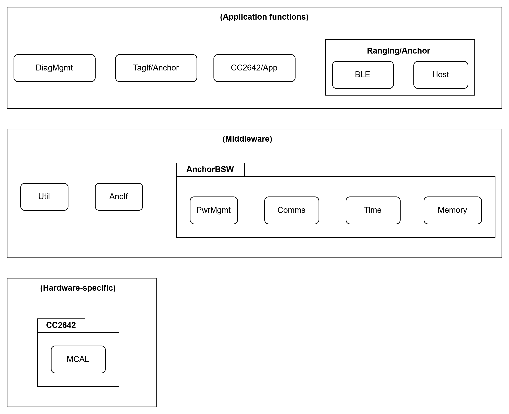
2. Application layer
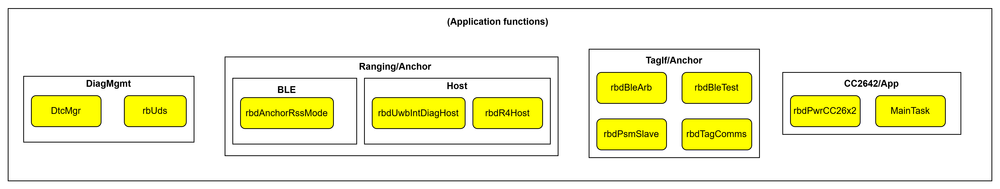
3. Middle layer
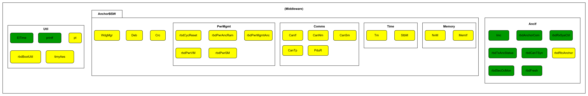 
4. Hardware_specific layer 

    
#### Stub and build:

1. Tx

- **Anchor status message**
  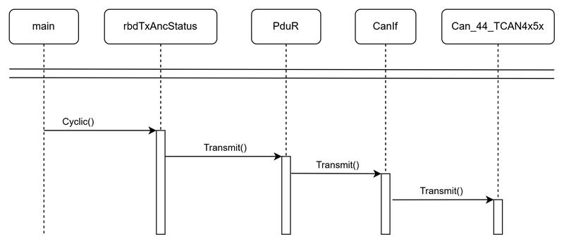
  - MainTask.c: rbdTxAncStatus_Cyclic();
  - rbdTxAncStatus.c: rbdTxAncStatus_Transmit() -> PduR_Transmit() = LoTransmit
  - PduR.c: LoTransmit = CanIf_Transmit();
  - CanIf.c: CanIf_Config.CanTrcv_Write
  - CanIf_Cfg.c: Can_44_TCAN4x5x_Write();
- *Verify message*
  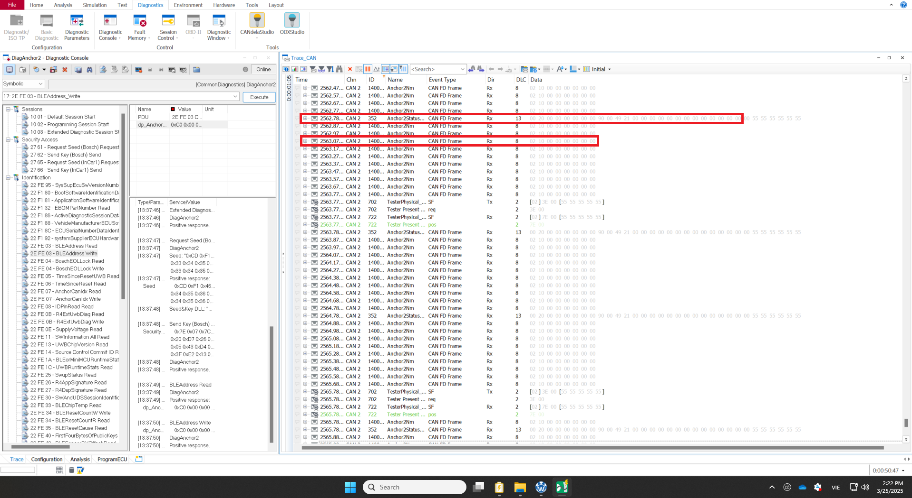
  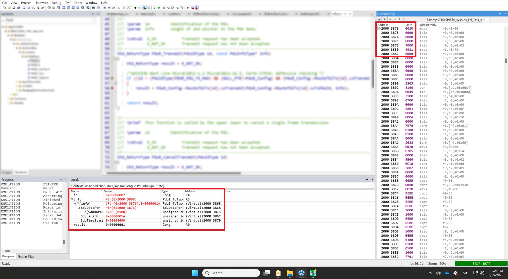
  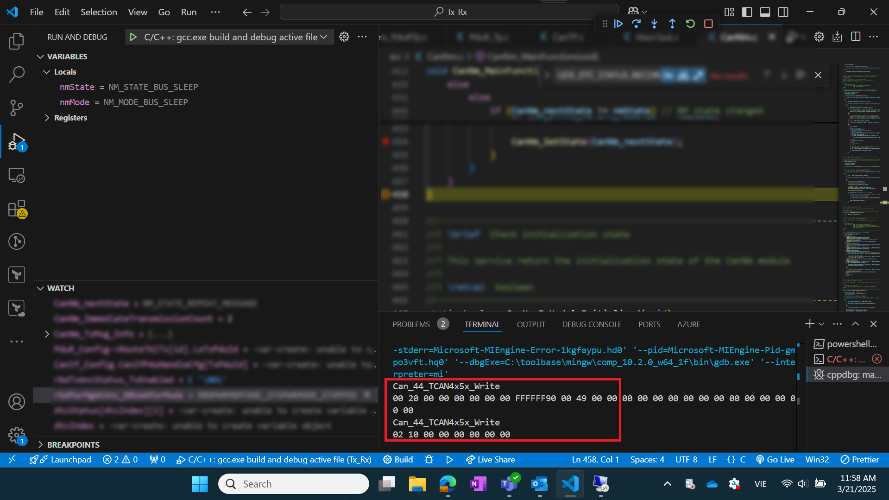
  
- **CanNm status message**
  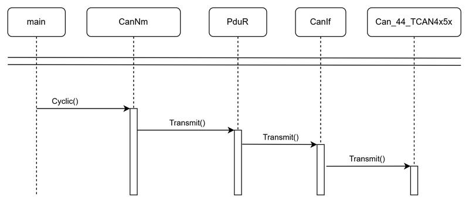
  - MainTask.c: CanNm_MainFunction();
  - CanNm.c: CanNm_SetState() -> CanNm_TriggerTransmission() -> PduR_Transmit() = LoTransmit
  - PduR.c: LoTransmit = CanIf_Transmit();
  - CanIf.c: CanIf_Config.CanTrcv_Write
  - CanIf_Cfg.c: Can_44_TCAN4x5x_Write();
- *Verify message*
  
  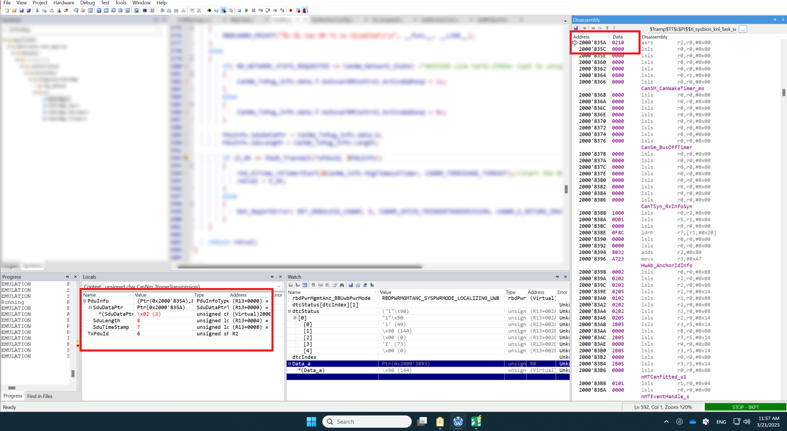
  

- **Anchorcom_tx message**
  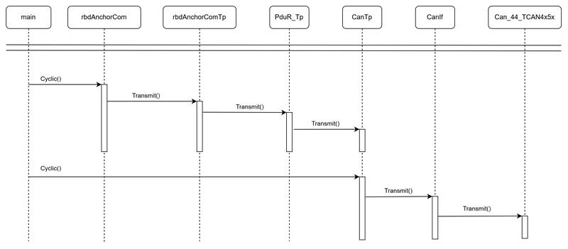
  - MainTask.c: rbdAnchorCom_CyclicTx();
  - rbdAnchorCom.c: rbdAnchorComTp_CyclicTx() -> rbdAnchorComTp_TxPart3() -> rbdAnchorComTp_TxStartTx() -> PduR_rbdAnchorComTpTransmit() -> PduR_TpTransmit() = LoTpTransmit
  - PduR.c: LoTpTransmit = CanTp_Transmit() -> buffer(Channel)
  - MainTask.c: CanTp_MainFunction()
  - CanTp.c: CanTp_Prv_ExecuteState() = CanTp_StateFunctions() = CanTp_Prv_TxTransmissionRequestAccepted
  - CanTp_Prv.c: CanTp_Prv_CanIfTransmit()
  - CanTp_prv.h : CanIf_Transmit()
  - CanIf.c: CanIf_Config.CanTrcv_Write
  - CanIf_Cfg.c: Can_44_TCAN4x5x_Write();

2. Rx
- **Anchorcom_rx message**
  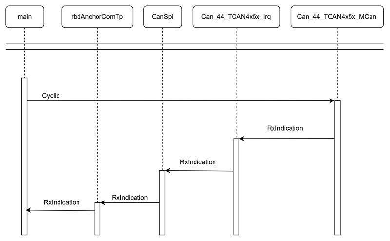
  - MainTask.c: CanSpi_Cyclic();
  - CanSpi.c: Can_44_TCAN4x5x_Irq_Handler()
  - Can_44_TCAN4x5x_Irq.c: Can_44_TCAN4x5x_MCAN_ProcessCanIRQLine0
  - Can_44_TCAN4x5x_MCan.c: Can_44_TCAN4x5x_MCAN_ProcessCanRx() -> Can_44_TCAN4x5x_SpiRead

<!-- ### Set Up

1. Load the compiled firmware onto the emulated platform using QEMU, as configured in step 1. -->

---

## TCAN - XL Driver

### Download and Install

#### Download the Driver:
1. Visit and download the latest release of the XL Driver from Vector follow this link:
https://www.vector.com/gb/en/products/products-a-z/libraries-drivers/xl-driver-library/#c75472
#### Install the Driver:
1. Follow the installation instructions provided in the repository.
2. Ensure that you follow the specific instructions for both Linux and Windows installations.
3. Here is some pictures from the instruction steps:


### Usage:

#### Overview of CAN Commands in XL Driver Library
   
The documentation provides a flowchart for CAN applications—from driver initialization to transmitting and receiving CAN messages. The functions are organized into the following groups:

- Initialization and Port Setup: Functions such as xlOpenDriver(), xlGetChannelMask(), xlOpenPort(), xlGetDriverConfig(), xlGetApplConfig(), xlSetApplConfig(), and xlGetChannelIndex() are used to initialize the driver, retrieve channel configuration details (e.g. channel mask, access mask), and open a communication port for the CAN channel.

- CAN Channel Configuration:

  - xlCanSetChannelMode(): This function allows you to specify whether the caller will receive a transmission completion or transmission request receipt for sent messages. For example, setting tx = 1 will enable the transmission receipt, while txrq = 1 will enable the transmission request receipt.
  - xlCanSetChannelOutput(): This function lets you switch the CAN chip between silent mode (no ACK when receiving; transmission is not allowed) and normal mode (with ACK). Silent mode is useful for diagnostic purposes where only reception is needed.

  - xlCanSetReceiveMode(): TThis function configures the receive mode by suppressing error frames and chip state events when set to ‘1’ (enabled by default).

  - xlCanSetChannelTransceiver(): This function is used to set the transceiver mode for the CAN channel. Parameters include:

     -  type: Specifies the transceiver type (e.g., XL_TRANSCEIVER_TYPE_CAN_252 for low-speed, XL_TRANSCEIVER_TYPE_CAN_1041 for high-speed, etc.).

    - lineMode: Sets the operating mode of the transceiver (e.g., sleep or normal).

    -  resNet: Reserved parameter (usually set to 0).

  - xlCanSetChannelParams() and xlCanSetChannelParamsC200(): These functions set the CAN timing parameters, such as bitrate, tseg1, tseg2, sjw (synchronization jump width), and sam (sample point). The xlCanSetChannelParamsC200() function uses specific btr0 and btr1 values for C200 or 527 compatible controllers.

  - xlCanSetChannelBitrate(): This simpler function sets the CAN bitrate using a fixed sample point (typically around 69% of the bit time).

- Acceptance Filter Configuration:

  - xlCanSetChannelAcceptance(): This function sets up a filter so that only messages matching the condition (where (id ^ code) & mask == 0) are accepted. By default, all message IDs are accepted after calling xlOpenPort().

  - xlCanAddAcceptanceRange(): This function allows adding an acceptance range for standard IDs, enabling the application to receive only messages within a specified ID window.

  - xlCanRemoveAcceptanceRange(): This function removes a previously defined acceptance range, effectively blocking messages within that range.

  - xlCanResetAcceptance(): This function resets the acceptance filter to an open state. The idRange parameter distinguishes between standard (XL_CAN_STD) and extended (XL_CAN_EXT) identifiers.

- Additional Functions:

  - xlCanRequestChipState(): This function requests the CAN controller's chip state. The resulting event (tagged XL_CHIP_STATE) contains information such as the bus status, tx error counter, and rx error counter.

  - xlCanTransmit(): This function transmits CAN messages on the selected channels. The messages are typically provided in an array of events (XLevent). Each event must be initialized (for example, with a memset call) and set with a tag like XL_TRANSMIT_MSG, and filled with the correct CAN ID, DLC, and data.

  - xlCanFlushTransmitQueue(): This function flushes the transmit queue of the selected channels, which can be useful when the internal transmit queue becomes full.

These functions are called in a defined sequence (as illustrated in the flowchart within the documentation) to ensure that the process of initializing, configuring, and operating the CAN channel is performed correctly ​XL Driver Library - Des…, ​XL Driver Library - Des….

#### Setup and Usage Process for CAN Commands
1. Initialization and Connection Setup:

- Call xlOpenDriver() to initialize the driver.

- Retrieve the channel mask using xlGetChannelMask() and open a port with xlOpenPort() using the appropriate access mask and queue size.

- Retrieve current driver configuration with xlGetDriverConfig() and application configuration with xlGetApplConfig()/xlSetApplConfig() to ensure the CAN channels are correctly set up.

2. Configuring the CAN Channel:

- Use xlCanSetChannelMode() to specify the receipt behavior for transmitted messages by setting the tx and txrq flags.

- Call xlCanSetChannelOutput() to set the output mode (silent vs. normal) of the CAN chip.

- Configure the receive mode via xlCanSetReceiveMode() to optionally suppress error frames and chip state events.

- Configure the transceiver using xlCanSetChannelTransceiver() to ensure the transceiver operates in the desired mode (e.g., sleep, normal, one-wire).

- Set up CAN timing parameters using xlCanSetChannelParams() (or xlCanSetChannelParamsC200() for specific controllers) with parameters like bitrate, sjw, tseg1, tseg2, and sam.

3. Setting Up the Acceptance Filter:

- To limit reception to specific message IDs, call xlCanSetChannelAcceptance() with the appropriate code and mask.

- Use xlCanAddAcceptanceRange() to open a specific range of IDs if needed.

- Use xlCanRemoveAcceptanceRange() to exclude a specific range of IDs.

- Finally, call xlCanResetAcceptance() to restore the filter to an open state (standard or extended IDs as required).

4. Transmitting and Receiving CAN Messages:

- Once the channels are configured and activated (using xlActivateChannel()), you can transmit messages with xlCanTransmit().

- Prior to transmission, initialize an array of events (XLevent) with the tag set to XL_TRANSMIT_MSG, and fill in the CAN ID, DLC, and data. The documentation recommends initializing the event structure (e.g., via memset) before calling the transmit function ​XL Driver Library - Des….

- Optionally, call xlCanFlushTransmitQueue() if the transmit queue is full.

5. Requesting Chip State:

- Use xlCanRequestChipState() to request the current state of the CAN controller. The chip state information (bus status, tx/rx error counters) is returned via an event with tag XL_CHIP_STATE.

#### Practical Applications
Examples such as xlCANdemo and xlCANcontrol provided in the documentation illustrate how to use these functions in practice:

- xlCANdemo: A command-line application that allows users to transmit and receive messages, configure acceptance filters, and check the chip state via keyboard commands (e.g., pressing <t> to transmit, <G> to request chip state, <R> to reset the clock, etc.).

- xlCANcontrol: A graphical application that shows the configured CAN channels, allows users to change settings such as baudrate, transmit messages, and monitor received messages through a visual interface. This example also demonstrates how to change the acceptance filter dynamically during operation ​XL Driver Library - Des….

By clearly separating the initialization, configuration, and operational phases, the XL Driver Library enables flexible and hardware-independent CAN application development, ensuring efficient and reliable transmission and reception of CAN data.

This detailed summary, based on the content of the "XL Driver Library - Description.pdf". Follow this link from Vector to know how to use XL Driver: https://cdn.vector.com/cms/content/products/XL_Driver_Library/Docs/XL_Driver_Library_Manual_EN.pdf  

---

## CAN Network Simulation - Busmaster

### Download and Install

#### Download Busmaster:
1. Visit the official Busmaster website: https://rbei-etas.github.io/busmaster/
2. Download the latest version of Busmaster for your system.

#### Install Busmaster:
1. Follow the installation instructions provided on the Busmaster website.
2. Complete the installation process on your machine.
3. Here is some pictures from the instruction steps:

 
 
 
 
 
 
 

### Set Up

#### Configure CAN Network:
1. Open Busmaster and configure the CAN network by adding the correct interfaces.
2. Set up virtual CAN devices for simulation.
 


#### Verify Connectivity:
1. Ensure that Busmaster is properly connected to the TCAN-XL driver to facilitate CAN communication.
2. Open exec example directory of XL Driver: TCAN\XL-Driver-example\exec

3. Run **xlCANdemo.exe**:
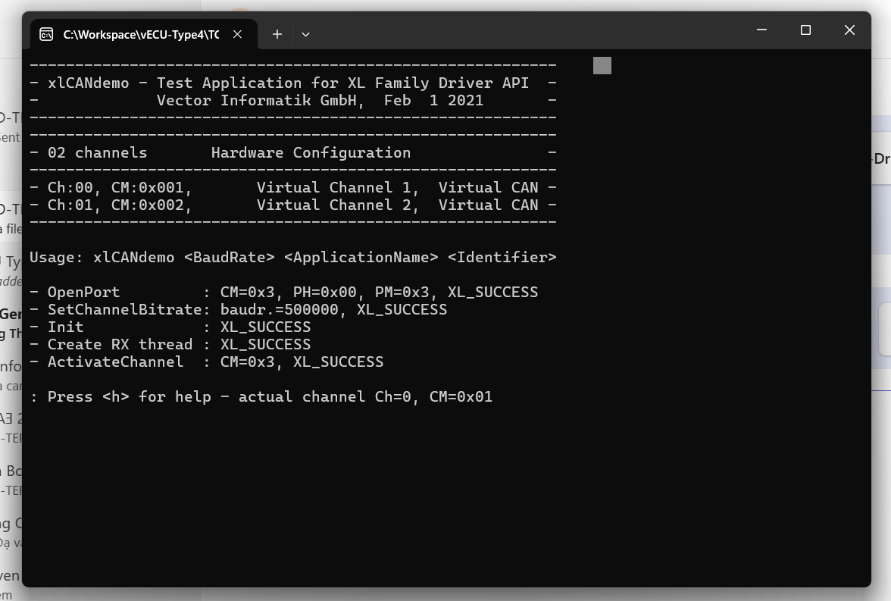
4. Type **t** in terminal: (transmit a message to Busmaster)

5. Verify received message in Busmaster's Message Window

---

## Usage

### Individual Components

#### QEMU:
After setup, you can start the QEMU emulator with the following command:

#### Basic Syntax
- View the help information for ARM machine:
   ```bash
    ./qemu-system-arm.exe -M help

- Connect the serial port to the standard input/output (stdio):
    ```bash
    ./qemu-system-arm.exe -serial stdio
            
- Connect to a file:
    ```bash
    ./qemu-system-arm.exe -serial file:output.log

- Connect to a socket: Simulate the serial port over the TCP protocol. The server will listen on port 4444:
    ```bash
    ./qemu-system-arm.exe -serial tcp:127.0.0.1:4444,server,nowait 

- Connect to a socket: Start QEMU with the netduinoplus2 machine type, load firmware.elf as the kernel, and use the terminal for monitoring:
    ```bash
    ./qemu-system-arm.exe -M netduinoplus2 -kernel firmware.elf -monitor stdio

- Run the QEMU virtual machine with both a kernel and a serial connection over TCP:
    ```bash
    ./qemu-system-arm.exe -M netduinoplus2 -kernel firmware.elf -monitor stdio -serial tcp:127.0.0.1:4444,server,nowait

Explanation of the Full Command:
 
* ./qemu-system-arm.exe: This is the QEMU ARM emulator. You're running it as an executable (probably on a Windows machine since you used .exe).

*  -M netduinoplus2: This specifies the machine type for Netduino Plus 2.

*  -kernel firmware.elf: This loads the firmware.elf file as the kernel/firmware for the machine.

*  -monitor stdio: This sets up QEMU's monitor interface to interact via the standard input/output (your terminal).

*  -serial tcp:127.0.0.1:4444,server,nowait: This configures the serial connection to be available via TCP on 127.0.0.1:4444. QEMU acts as the server for the serial connection, and nowait means the VM won't wait for a client to connect.
---
### Integrated Setup
- Prepare firmware with SPI implementation
    ```bash
    cd ./stm32
- Run QEMU
    ```bash
    ./qemu-system-arm.exe -M netduinoplus2 -kernel ./stm32/cc2642.elf -chardev socket,id=spi_uart_tcp,host=localhost,port=1234,server=on,wait=on -serial null -monitor stdio -nographic
- Run TCAN (using XL Driver)
    ```bash
    cd ./TCAN/Xl_driver_sw
    mkdir build
    cd build
    cmake -G "MinGW Makefiles" ..
    make

    ./autosar_executable.exe

- Run Busmaster
    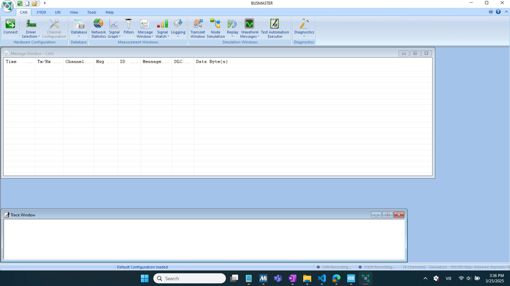
    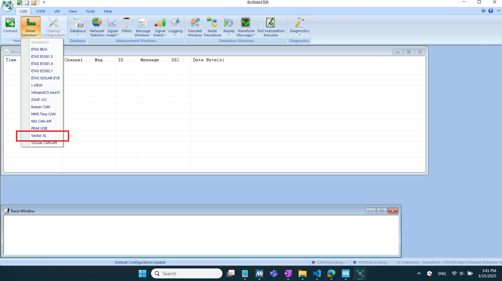
    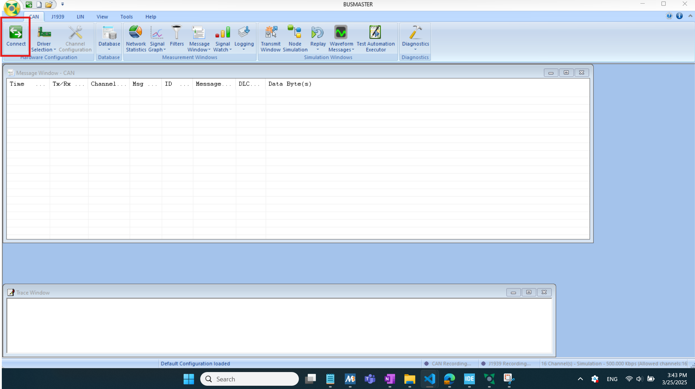
    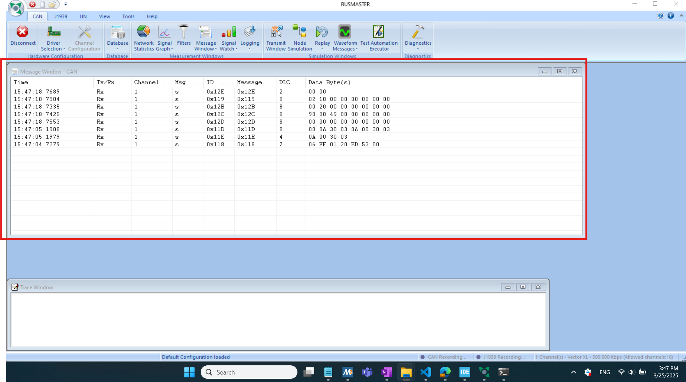

- Integration window
    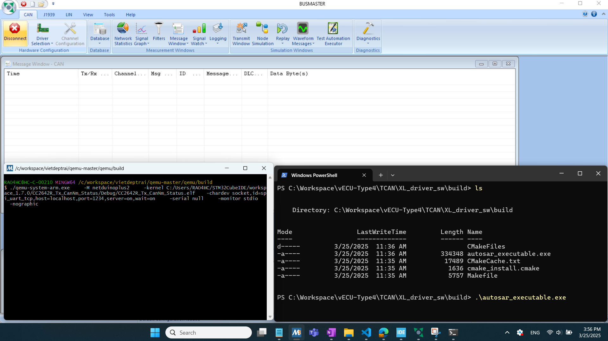
    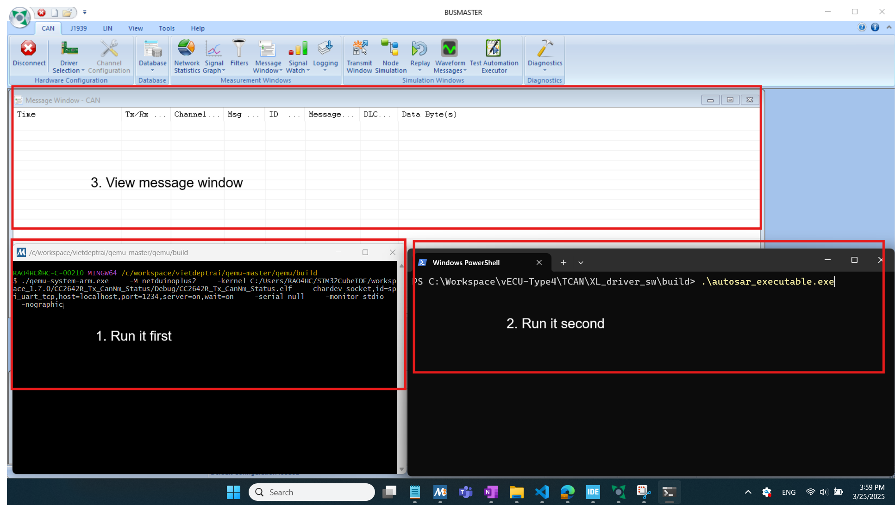
    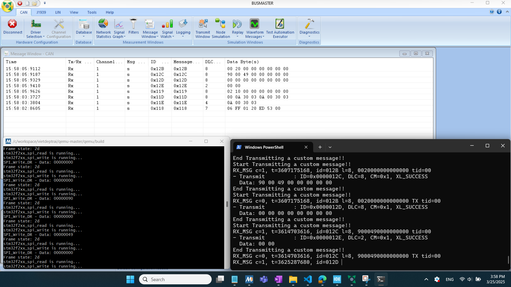
    


## Copyright

© 2025 All Rights Reserved.

<!-- This documentation and any associated software are provided under the terms of the [License Name] License. -->

For inquiries or support, please contact: 

1. CAO DUC VINH [duc-vinh-81770926b](https://www.linkedin.com/in/duc-vinh-81770926b/).
2. TRUONG TAN [tantruongg23](http://linkedin.com/in/tantruongg23).
3. NGUYEN QUOC VIET [mrviet1502](https://www.linkedin.com/in/mrviet1502/).

**Disclaimer**: This document and the software are provided "as is," without any warranties of any kind, either express or implied, including but not limited to the warranties of merchantability, fitness for a particular purpose, or noninfringement. In no event shall the authors be liable for any claim, damages, or other liability, whether in an action of contract, tort, or otherwise, arising from, out of, or in connection with the software or the use or other dealings in the software.


